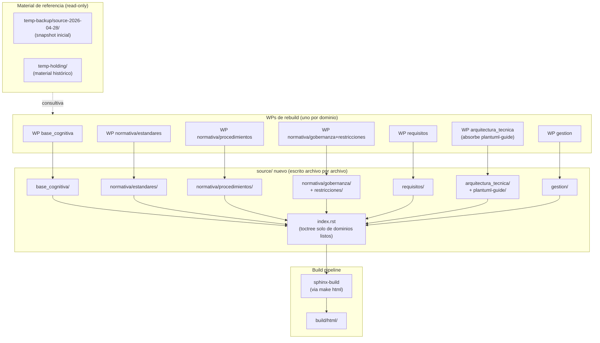

```yml
created_at: 2026-04-28 04:10:00
project: IACT-docs
work_package: 2026-04-28-01-58-08-source-rebuild-strategy
phase: Phase 5 — STRATEGY
architecture_version: 1.0
architect: NestorMonroy
stack_version: Sphinx 8.2.3 + Furo 2025.9.25 + Python 3.11 + RST puro
status: Borrador
```

# Solution Strategy: Source Rebuild

## Propósito

Definir CÓMO reconstruir `source/` (379 archivos `.rst`, 34 patrones
de naming, 147 hyperlinks rotos, errores editoriales heredados) para
producir un `source/` limpio, alineado a STD_007, sin warnings ni
errores, y con criterio editorial aplicado en cada archivo.

Este documento traduce las decisiones de Phase 1 DISCOVER (D1-D5,
F-04, F-05) en una arquitectura ejecutable que los WPs de rebuild
de dominio (8 hijos) van a seguir.

---

## Key Ideas

### Idea 1: Backup-as-reference rebuild (no lift-and-shift)

**Descripción:** ni `temp-backup/` ni `temp-holding/` son fuentes de
copia. Son material consultivo. El nuevo `source/` se ESCRIBE,
archivo por archivo, con criterio editorial — leyendo los temp-*
como insumo, decidiendo qué sobrevive, se fusiona, se reescribe o
se descarta.

**Impacto:**
- Elimina la propagación de errores heredados (los problemas de
  diseño/contenido del `source/` actual no llegan al nuevo).
- Aumenta el esfuerzo 5–10x respecto a un copy-and-rename mecánico,
  pero produce un `source/` que no necesita un segundo cleanup
  posterior.
- Cambia el criterio de aceptación por dominio: ya no es "todo
  archivo del backup está en source/ con su nuevo nombre" sino
  "todo archivo del backup está clasificado como
  incorporado / fusionado-en-X / reescrito / descartado-con-razón".

### Idea 2: Reconstrucción incremental dominio por dominio con bridge

**Descripción:** los 8 dominios se reconstruyen uno a la vez en
WPs separados. Mientras un dominio está en rebuild, los demás
permanecen intactos en su estado actual o en `temp-backup/`. El
sitio publicado siempre construye porque `source/index.rst` solo
lista los dominios reconstruidos; los pendientes viven fuera del
toctree y Sphinx no los conoce → no genera refs ni warnings.

**Impacto:**
- Build verde durante todo el rebuild (no hay big-bang).
- Cada WP de dominio es atómico, revisable y revertible.
- Permite pausar el rebuild entre dominios sin dejar el repo en
  estado inconsistente.

### Idea 3: Estándares-first

**Descripción:** STD_007 (naming), STD_006 (versionado en metadata,
no en filename) y los demás STDs definen el estado objetivo desde
el día uno. No se reconstruye "como esté" para luego normalizar —
se reconstruye YA siguiendo los estándares vigentes.

**Impacto:**
- IDs semánticos (UC_001, BR_001, FND_01, STD_007 mismo) se
  preservan donde STD_007 los codifica.
- Caracteres prohibidos (espacios, ñ, tildes, paréntesis) no
  entran al nuevo `source/`.
- Versiones viven en metadata YAML, nunca en filename.
- `index.rst` como punto de entrada único por directorio (no
  README.rst paralelos).

### Idea 4: RST puro, sin Markdown

**Descripción:** myst-parser eliminado. El nuevo `source/` es 100%
RST. Decisión del ejecutor (F-NEW-5).

**Impacto:**
- Una sola sintaxis a aprender por nuevos contribuidores.
- Sphinx-tabs y todas las directivas avanzadas funcionan
  consistentemente.
- Pérdida: archivos `.md` del `source/` actual o de `temp-holding/`
  deben reescribirse a RST si su contenido se quiere conservar.
- `source_suffix = '.rst'` ya está limpio en `conf.py`.

### Idea 5: Criterio editorial humano-en-el-loop

**Descripción:** Claude propone una clasificación inicial por
archivo (incorporar / fusionar-con-X / reescribir / descartar) en
el discover de cada WP de rebuild de dominio. El ejecutor confirma
o corrige antes de iniciar la ejecución.

**Impacto:**
- Velocidad asistida sin perder control editorial.
- Decisiones quedan documentadas en cada WP — no son tácitas.
- Si el ejecutor se vuelve cuello de botella, la opción es batch:
  validar dominio entero en una sesión en vez de archivo por
  archivo.

---

## Fundamental Decisions

### Decision 1: Orden de reconstrucción por dependencia

**Alternatives Considered:**
- Por tamaño (chico primero) — `plantuml-guide` (8 archivos) o
  `arquitectura_tecnica` (15) primero. Pro: feedback rápido. Con:
  empezar por dependientes deja los dominios base en estado
  inconsistente.
- Alfabético — `arquitectura_tecnica` primero. Sin justificación
  técnica.
- **Por dependencias salientes (de menos a más, elegida).**

**Justification:**
- `base_cognitiva` (33 archivos) provee el vocabulario (glosario,
  ontología, fundamentos) — sin esto, los demás dominios pueden
  introducir términos inconsistentes.
- `normativa/estandares/` (~10) viene segundo — los STDs son
  referencia para todo lo demás (incluido este propio rebuild).
- Sigue la cadena: procedimientos → gobernanza/restricciones →
  requisitos → arquitectura técnica → gestión.
- `plantuml-guide` se resuelve dentro de `arquitectura_tecnica`
  (decisión F-04).

**Implications:**
- 7 WPs de rebuild de dominio (no 8 — plantuml-guide se absorbe).
- El orden permite que cada WP nuevo pueda apoyarse en términos y
  patrones definidos por los anteriores.
- Si un dominio de "abajo" descubre que necesita ajustar uno ya
  reconstruido, se hace en un WP separado, no en cascada.

### Decision 2: `temp-backup/` se crea al inicio del primer WP de rebuild

**Alternatives Considered:**
- Crear `temp-backup/` ahora en este WP DISCOVER — Pro:
  disponible para Phase 5/6. Con: ocupa repo space sin que se
  esté usando todavía.
- Crear al inicio de cada WP de dominio (snapshot por dominio) —
  Pro: granular. Con: 7 snapshots redundantes.
- **Crear UNA vez al inicio del primer WP de rebuild
  (`source-rebuild-base-cognitiva`), persistir hasta el final.**

**Justification:**
- Un único snapshot del estado verificado "0 warnings" al momento
  de empezar (F-NEW-3 ya verificado).
- Sirve a los 7 WPs de dominio como referencia inmutable.
- Eliminación al cerrar el último WP de dominio (CLEANUP).

**Implications:**
- Ocupa ~8 MB versionados temporalmente en feature branches.
- Recuperable siempre vía git history aunque se borre el directorio.

### Decision 3: Build sin `-W` durante rebuild, con `-W` al final

**Alternatives Considered:**
- `-W` siempre (rigor máximo) — bloquearía el rebuild la primera
  vez que un dominio en transición tenga refs huérfanas
  legítimas (porque el dominio destino aún no está reconstruido).
- Sin `-W` nunca — pierde el rigor que el CI ya aplica.
- **Sin `-W` durante el rebuild, con `-W` al final del último
  dominio (decisión D3 confirmada).**

**Justification:**
- Pragmatismo durante la transición.
- El CI (`validate.yml`) ya usa `-W` y validará en cada PR — actúa
  como red de seguridad continua.
- Recuperar `-W` localmente solo cuando todo encaje.

**Implications:**
- Cada WP de dominio puede generar warnings transitorios —
  documentarlos en su track changelog.
- Al final del último WP de dominio, agregar tarea explícita:
  "verificar build con -W exit 0".

### Decision 4: Sphinx-tabs incluido proactivamente, plantuml requerido

**Alternatives Considered:**
- Sin sphinx-tabs (deshabilitar también) — Pro: dependencias
  mínimas. Con: contradice la intención del ejecutor de usarlo
  correctamente en el nuevo source/.
- Sphinx-tabs + sphinx-toolbox — descartado en F-NEW-4 (toolbox
  unused, conflicto con tabs 3.5.0).
- **Sphinx-tabs habilitado en `conf.py`, sphinx-toolbox eliminado,
  plantuml.jar gestionado por setup.sh con guard en Makefile.**

**Justification:**
- Tabs habilitado de antemano evita "agregar la extension cuando
  el primer WP la necesite" — la directiva está disponible para
  cualquier dominio que la requiera.
- Plantuml es esencial (29 archivos `.puml` en repo) — el guard
  garantiza que el bootstrap esté completo antes de build.

**Implications:**
- Skill `sphinx` cargado provee referencia para uso correcto de
  `.. tabs::`, `.. tab::`, `.. group-tab::`, `.. code-tab::`.
- Cualquier futura adición de extensions requiere actualizar
  conf.py + verificar conflicto en pyproject.toml + re-`uv sync`.

### Decision 5: Cada WP de rebuild de dominio tiene su propio ciclo THYROX

**Alternatives Considered:**
- Un mega-WP que cubra los 7 dominios — inmanejable, mezcla
  decisiones independientes.
- Sub-tasks dentro de este WP — viola la regla de granularidad
  (este WP es DISCOVER de la estrategia, no implementación).
- **7 WPs hermanos, cada uno con su propio DISCOVER → STRATEGY
  → PLAN → DESIGN → EXECUTE → TRACK.**

**Justification:**
- Cada dominio tiene su propio inventario, sus propias decisiones
  de fusión/descarte, su propio scope.
- Permite paralelización si en algún momento se ejecutan dos
  dominios independientes en simultáneo (no recomendado al inicio).
- Audit trail granular por dominio.

**Implications:**
- Repositorio acumula 7 WPs nuevos en `.thyrox/context/work/`.
- Este WP (`source-rebuild-strategy`) queda como WP-padre
  conceptual — referenciado por todos los hijos.

---

## Technology Stack (heredado, no es decisión nueva de Phase 5)

```
Documentation engine:    Sphinx 8.2.3
Theme:                   Furo 2025.9.25
Source format:           reStructuredText (RST puro)
Markdown parser:         NINGUNO (myst-parser eliminado, F-NEW-5)
Diagram engine:          PlantUML 1.2024.7 (vía sphinxcontrib-plantuml)
Tabs:                    sphinx-tabs 3.5.0
Spell check:             sphinxcontrib-spelling 8.0.2 (requiere libenchant)
Python:                  3.11
Dep manager:             uv 0.8.17 + pyproject.toml + uv.lock
Bootstrap:               scripts/setup.sh (idempotente, 6 pasos)
Build target:            make html (con guard check-bootstrap, F-NEW-7)
CI:                      .github/workflows/validate.yml (sphinx-build -W)
```

**Justification:** stack ya en uso, no se cambia en este WP. Las
únicas modificaciones aplicadas son las de F-NEW-4 (drop
sphinx-toolbox), F-NEW-5 (drop myst-parser), F-NEW-6 (settings
allowlist) y F-NEW-7 (Makefile guard) — todas para enabling, no
para disrupción.

---

## Architecture Patterns

### Structural Patterns

- **Domain-by-domain rebuild** — separación estricta por dominio
  durante la reconstrucción.
- **Reference-only sources** — `temp-backup/` y `temp-holding/`
  como advisory inputs, nunca como copy origin.
- **Single entry point per directory** — `index.rst` (no
  README.rst paralelos).
- **Semantic IDs in filenames** — `UC_001`, `BR_001`, `STD_007`
  según STD_007.

### Behavioral Patterns

- **Editorial classification per file** — incorporar / fusionar /
  reescribir / descartar.
- **Bridge plan via toctree** — solo dominios reconstruidos van al
  toctree maestro; los pendientes viven fuera.
- **Fail-fast bootstrap** — guard en Makefile aborta build si
  setup incompleto.

### Architectural Styles

- **Incremental migration** — sin big-bang, sin freeze del repo.
- **Standards-first** — STDs definen estado objetivo desde día 1.

---

## Diagrama de Arquitectura



---

## How We Achieve Quality Goals

### Quality Goal 1: 0 warnings, 0 errores en build final

**Approach:** estándares-first + guard de bootstrap + CI con `-W`.

**Mechanisms:**
- STD_007 aplicado desde el primer archivo del rebuild.
- Refs entre dominios usan `:ref:` con anchor explícito (no
  `:doc:` con path) — robustez frente a futuros renombres.
- `make html` con `check-bootstrap` previene build con
  pre-condiciones faltantes.
- CI corre `sphinx-build -W` en cada PR.

**Technologies:** Sphinx 8.2.3, sphinxcontrib-plantuml,
sphinxcontrib-spelling.

### Quality Goal 2: Trazabilidad editorial

**Approach:** clasificación explícita por archivo + WP-changelogs
por dominio.

**Mechanisms:**
- Cada archivo del backup termina marcado: incorporado / fusionado /
  reescrito / descartado-con-razón.
- Cada WP de dominio mantiene su track changelog con todas las
  decisiones.
- ADRs en `.thyrox/context/decisions/` para decisiones
  arquitectónicas que trasciendan un dominio.

### Quality Goal 3: Build verde durante toda la migración

**Approach:** bridge via toctree + sin `-W` durante rebuild.

**Mechanisms:**
- `source/index.rst` lista solo dominios reconstruidos.
- Dominios pendientes viven en `temp-backup/` (fuera del toctree).
- CI sigue siendo strict — actúa como red de seguridad por PR.

---

## Adherence to Constraints

### Constraint: STD_007 (naming convention)

**How we respect it:** todo archivo del nuevo `source/` cumple
STD_007 antes de incorporarse — kebab para guías generales,
snake_case para directorios, IDs semánticos donde STD_007 los
codifica, `index.rst` como entry-point.

### Constraint: STD_006 (semantic versioning, version in metadata)

**How we respect it:** ningún filename del nuevo `source/` lleva
versión. Versiones viven en bloque YAML del archivo (`:version:`).

### Constraint: I-002 (git as persistence, no `.bak` files)

**How we respect it:** `temp-backup/` es directorio único
versionado, no copias `.bak` por archivo. Recuperación vía git
history o git revert.

### Constraint: Build verde requerido por CI

**How we respect it:** bridge plan + dominios fuera de toctree
mientras se reconstruyen. Cada PR del rebuild se valida con
`-W` por validate.yml.

### Constraint: Bootstrap dependiente de `setup.sh`

**How we respect it:** Makefile `check-bootstrap` falla rápido
con mensaje accionable si `setup.sh` no se ejecutó. CI corre
`setup.sh` siempre.

---

## Traceability to Analysis

### Satisfying Findings

- **F-04** (plantuml-guide destination) → Decision 1: absorbido
  por WP `arquitectura_tecnica`.
- **F-05** (`_static/`/`_templates/`) → mantienen ubicación, no
  se mueven (decisión confirmada en discover).
- **F-NEW-3** (premisa 0 warnings) → verificada; baseline para
  `temp-backup/`.
- **F-NEW-4** (pyproject contradicciones) → resuelta vía
  eliminación de sphinx-toolbox; sphinx-tabs preservado por
  Decision 4.
- **F-NEW-5** (no Markdown) → Idea 4 (RST puro).
- **F-NEW-6** (rm -rf prompts) → resuelto vía settings allowlist.
- **F-NEW-7** (setup.sh visibility) → spawneado WP
  `bootstrap-hardening`; Makefile guard ya implementado.

### Satisfying Decisions

- **D1** (temp-backup versionado) → Decision 2.
- **D2** (base_cognitiva primero) → Decision 1, primer WP.
- **D3** (sin -W durante rebuild) → Decision 3.
- **D4** (no tensión en STD_007) → Idea 3.
- **D5** (backup as reference) → Idea 1.

---

## Evidencia de respaldo

| Claim | Tipo | Fuente | Confianza | Origen |
|-------|------|--------|-----------|--------|
| `source/` actual tiene 0 warnings con setup completo | PROVEN | Output de `uv run sphinx-build -E -b html source/ build/html-verify` 2026-04-28 03:55 → "build succeeded." (cero warnings) | alta | nuevo |
| `source/` contiene 379 .rst en 8 dominios | PROVEN | `find source -name "*.rst" \| wc -l` → 379 (verificado en discover) | alta | heredado-verificado |
| sphinx-toolbox no es usado en source/ | PROVEN | `grep -rn "sphinx_toolbox\|.. collapse::" source/` → 0 ocurrencias | alta | nuevo |
| sphinx-tabs no es usado actualmente en source/ | PROVEN | `grep -rn ".. tabs::" source/` → 0 ocurrencias; se incluye proactivamente para nuevo source/ | alta | nuevo |
| temp-holding contiene 5 backups anidados | PROVEN | `ls temp-holding/GENERACION_DOCUMENTACION/` muestra IACT_Backup_Completo_2026-01-11/, IACT_Backup_Completo_2026-01-11-old/, TMP_COMPLETO_2026-01-13/, TMP_COMPLETO_2026-01-13_OK/, TMP_COMPLETO_IACT_2026-01-13_2/ | alta | nuevo |
| pyproject.toml + uv.lock sincronizados post-fix | PROVEN | `uv sync` exit 0 + `.venv/bin/sphinx-build --version` → 8.2.3 | alta | nuevo |
| CI (validate.yml) corre setup.sh + -W | PROVEN | Read de .github/workflows/validate.yml líneas 32-38 | alta | nuevo |
| Rebuild dominio-por-dominio no rompe build si toctree filtra pendientes | INFERRED | Comportamiento conocido de Sphinx: archivos fuera del toctree no se procesan; sin processing no hay warnings/refs. Confirmar empíricamente en primer WP de dominio. | media | inferencia-stage5 |
| Esfuerzo 5–10x para rebuild editorial vs lift-and-shift | SPECULATIVE | Estimación cualitativa sin benchmarks empíricos. Útil como ranking, no como estimación de schedule. | baja | nuevo-flagged |

---

## Validation Checklist

- [x] Key ideas clearly articulated (5 ideas)
- [x] Fundamental decisions documented (5 decisions)
- [x] Alternatives considered for each decision
- [x] Clear justifications
- [x] Technology stack documented (heredado)
- [x] Patterns explained (structural, behavioral, architectural)
- [x] Quality goals addressed (3 goals)
- [x] Constraints respected (5 constraints)
- [x] Traceable to Phase 1 DISCOVER findings/decisions
- [x] Evidencia de respaldo con ≥3 claims clasificados (9 claims)
- [x] No claim SPECULATIVE fundamenta una decisión de gate (la
      única SPECULATIVE está flagged como tal y no es input de
      decisión arquitectónica)

---

## Siguiente Paso

Una vez aprobada esta estrategia:
→ Phase 6 PLAN — definir scope (in/out) detallado del WP-padre y
   listar los 7 WPs de rebuild de dominio que se van a abrir.
