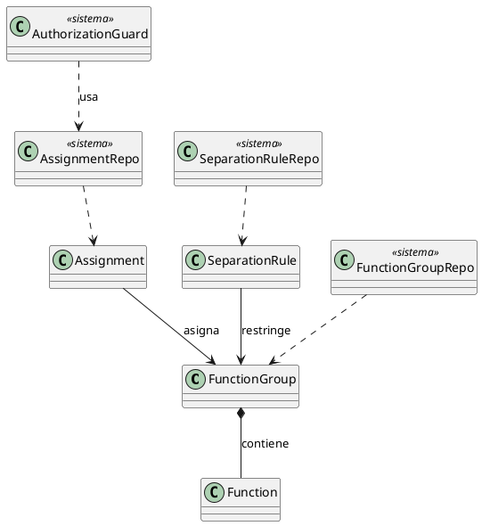
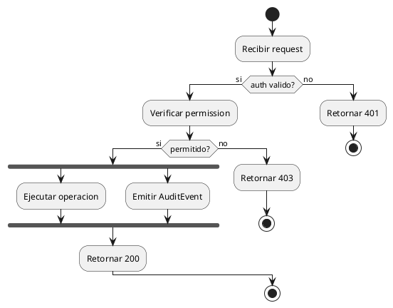
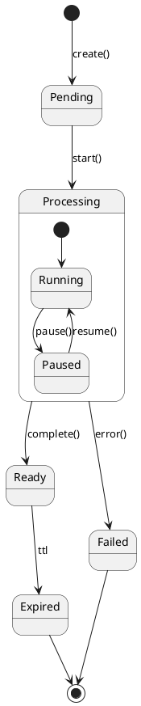

```yml
created_at: 2026-05-06 05:34:00
project: IACT-docs
work_package: 2026-05-06-05-28-57-design-view-buildout
phase: Phase 5 — STRATEGY
author: NestorMonroy
status: Borrador
version: 1.0.0
```

# Phase 5 STRATEGY — Design View Buildout

## Decisiones clave (D-01..D-08)

### D-01 — Naming auto-explicativo (heredado de WP UseCaseView)

```
{tipo}-{slug-descriptivo-en-espanol-sin-acentos}.rst

Tipos: package | class | seq | act | state
```

Ejemplos:
- `class-access.rst`
- `seq-permissions.rst`
- `act-rbac-effective-set-eval.rst`
- `state-pipeline-execution.rst`

### D-02 — Vocabulario solo del domain-model canonico

Toda referencia a clases/servicios/repos/policies en los diagramas usa el nombre PascalCase exacto del archivo en `domain-model/`. Ejemplo:

| Antes (legacy) | Despues (canonico) |
|---|---|
| `ServicioAcceso` | `(no existe — usar AssignmentRepo + AuthorizationGuard)` |
| `RepositorioAssignment` | `AssignmentRepo` |
| `ServicioRBAC` | `AuthorizationGuard` |
| `AlmacenDatos` | (no aparece — los repos abstraen DB) |
| `InterfazAdmin` | (la UI no es elemento del Design View — usar funcion RBAC como actor iniciador) |

### D-03 — Stereotypes consistentes con WP UseCaseView

| Stereotype | Uso |
|---|---|
| (sin stereotype) | Funcion RBAC iniciadora |
| `<<beneficiario>>` | Funcion RBAC consumidora |
| `<<sistema>>` | Clase del domain-model (Service/Repo/Guard/etc) |
| `<<externo>>` | Actor fuera del sistema (Caller no autenticado) |

### D-04 — Class diagrams no duplican domain-model

Cada `class-{mod}.rst` declara:

1. **Una nota inicial** explicando: "Este modulo agrupa las siguientes clases del domain-model. Para definicion de cada clase, ver el archivo correspondiente."
2. **Class boxes minimas**: solo el nombre, sin atributos ni metodos. Diagrama enfocado en relaciones del modulo.
3. **Cross-refs `:doc:`** al final, una por cada clase referenciada.

Ejemplo PlantUML:



### D-05 — Sequence diagrams armonizados al canonico

Patron uniforme:

```plantuml
@startuml
actor "<funcion_rbac>" as <funcion_rbac>
actor "AuthorizationGuard" as AuthorizationGuard <<sistema>>
actor "<DomainServiceX>" as <DomainServiceX> <<sistema>>
actor "<RepoY>" as <RepoY> <<sistema>>

<funcion_rbac> -> AuthorizationGuard : verify(<funcion_rbac>)
AuthorizationGuard --> <funcion_rbac> : OK
<funcion_rbac> -> <DomainServiceX> : operacion(...)
<DomainServiceX> -> <RepoY> : query/update
<RepoY> --> <DomainServiceX> : data
<DomainServiceX> --> <funcion_rbac> : resultado

note right of AuthorizationGuard
  CNST-001: toda operacion verificada
end note
@enduml
```

### D-06 — Activity diagrams (uml-11 puro)

Patron PlantUML activity v2:



### D-07 — State diagrams (uml-08)

Patron PlantUML state machine:



### D-08 — Audit script `validate-design-view.sh`

Checks (analogos al WP UseCaseView):

| Check | Verifica |
|---|---|
| C-01 | Todo archivo tiene `.. meta::` con `:tipo: Diagrama Arquitectonico — Design View — {subtipo}` |
| C-02 | Todo `<<sistema>>` actor existe como `domain-model/{snake-name}.rst` |
| C-03 | Toda funcion RBAC iniciadora existe en el catalogo CNST-033 |
| C-04 | NO uml-12 (componentes) ni uml-13 (distribucion) syntax |
| C-05 | `seealso` con cross-refs a domain-model + use-case-view |
| C-06 | `@startuml` sin name (D-04 anti `@startuml NAME` per WP plantuml-cache-corruption) |

## Template canonico por tipo

### Template `class-{mod}.rst`

```rst
.. meta::
 :artefacto: AT_DESIGN_CLASS_<MOD>
 :tipo: Diagrama Arquitectonico — Design View — Class
 :dominio: arquitectura_tecnica
 :subdominio: DesignView
 :estado: Vigente
 :version: 1.0.0
 :fecha_creacion: 2026-05-06
 :ultimo_cambio: 2026-05-06
 :autor: NestorMonroy
 :clasificacion: Interno

.. _at_design_class_<mod>:

============================================================
Design View — MOD_<Mod>: Estructura de Clases
============================================================

Vista de paquete del modulo MOD_<Mod>. Agrupa las clases del
domain-model que participan en este bounded context y muestra
sus relaciones internas.

NO duplica las definiciones (atributos/metodos) — esas viven
en `domain-model/*.rst`. Aqui solo se ven las clases como cajas
y las relaciones del paquete.

.. uml::
 :caption: MOD_<Mod> — clases y relaciones internas.

 @startuml

 class Entity1
 class Entity2
 class ServiceX <<sistema>>
 class RepoY <<sistema>>

 Entity1 *-- Entity2
 ServiceX ..> Entity1 : usa
 RepoY ..> Entity1 : persiste

 @enduml

.. seealso::

 - :doc:`/arquitectura-tecnica/domain-model/entity1`
 - :doc:`/arquitectura-tecnica/domain-model/entity2`
 - :doc:`/arquitectura-tecnica/domain-model/service-x`
 - :doc:`/arquitectura-tecnica/domain-model/repo-y`
 - :doc:`/arquitectura-tecnica/use-case-view/<mod>/index`
```

### Template `seq-{mod}.rst` (armonizado)

```rst
.. meta::
 :artefacto: AT_DESIGN_SEQ_<MOD>
 :tipo: Diagrama Arquitectonico — Design View — Sequence
 ...

============================================================
Design View — MOD_<Mod>: Patron de Interaccion
============================================================

Secuencia canonica de la operacion principal del modulo
MOD_<Mod>. Los actores `<<sistema>>` son clases canonicas
del domain-model.

.. uml::
 :caption: MOD_<Mod> — flujo principal con verificacion RBAC + audit.

 @startuml

 actor "<funcion_rbac>" as <funcion_rbac>
 actor "AuthorizationGuard" as AuthorizationGuard <<sistema>>
 actor "<RepoX>" as <RepoX> <<sistema>>
 actor "AuditService" as AuditService <<sistema>>

 <funcion_rbac> -> AuthorizationGuard : verify(<funcion_rbac>)
 AuthorizationGuard --> <funcion_rbac> : OK
 <funcion_rbac> -> <RepoX> : operacion(...)
 <RepoX> --> <funcion_rbac> : resultado
 <funcion_rbac> -> AuditService : emit(AuditEvent)

 @enduml

.. seealso::
 ...
```

### Template `act-{flujo}.rst`

```rst
.. meta::
 :artefacto: AT_DESIGN_ACT_<FLUJO>
 :tipo: Diagrama Arquitectonico — Design View — Activity
 ...

============================================================
Design View — Flujo: <Descripcion>
============================================================

Flujo de actividad del proceso <descripcion>. Cubre los UCs
<UC_X_NN, UC_Y_MM>.

.. uml::
 :caption: Flujo <descripcion> — actividades y decisiones.

 @startuml

 start
 :Paso 1;
 if (Decision?) then (si)
   :Camino A;
 else (no)
   :Camino B;
 endif
 stop

 @enduml
```

### Template `state-{entidad}.rst`

```rst
.. meta::
 :artefacto: AT_DESIGN_STATE_<ENTIDAD>
 :tipo: Diagrama Arquitectonico — Design View — State Machine
 ...

============================================================
Design View — Ciclo de Vida: <Entidad>
============================================================

Ciclo de vida de la entidad <Entidad> del domain-model. Estados
y transiciones disparadas por eventos del sistema.

.. uml::
 :caption: <Entidad> — estados y transiciones.

 @startuml

 [*] --> EstadoInicial : trigger
 EstadoInicial --> EstadoX : evento_a
 EstadoX --> [*] : evento_z

 @enduml

.. seealso::
 - :doc:`/arquitectura-tecnica/domain-model/<entidad>`
```

## Pipeline de generacion (Phase 10)

Por cada batch (modulo o tipo):

1. Crear los archivos del batch usando el template.
2. Llenar contenido per dominio (consultar UCs y domain-model).
3. Commit Tim Pope.
4. Push.
5. Cuando termine la batch grande (e.g. 13 class-{mod} de un saque), correr prerender + strict build.
6. SP-04 gate tecnico antes del siguiente batch.
