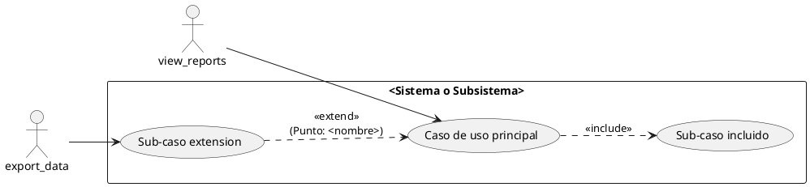
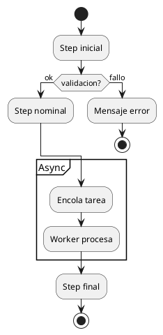
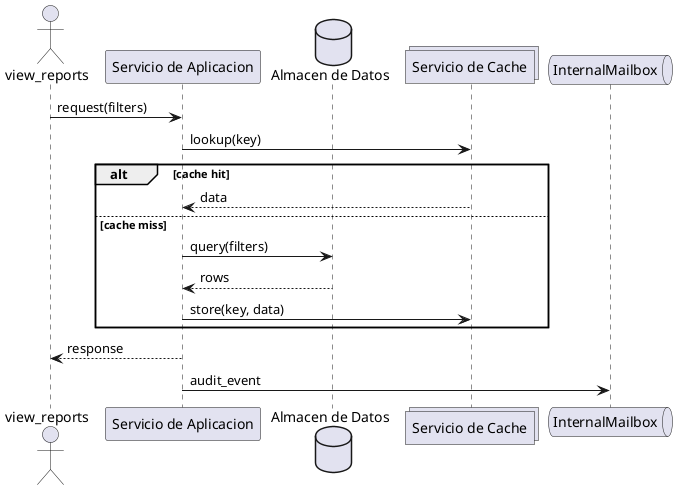
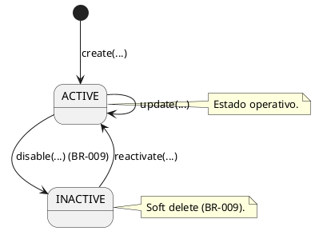
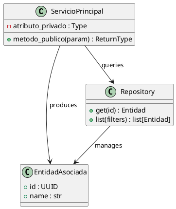
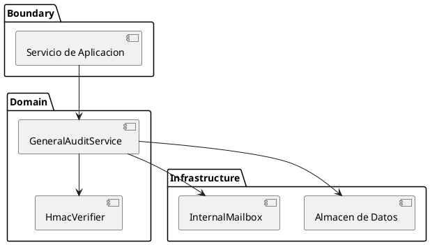

```yml
created_at: 2026-05-07 16:30:00
project: IACT-docs
work_package: 2026-05-07-14-49-04-uml-diagrams-deep-audit
phase: Phase 5 — STRATEGY
author: NestorMonroy
status: Borrador
version: 1.0.0
type: T-006 UML-07 Patterns by Category
```

# T-006 — Patrones UML-07 obligatorios por categoria de UC

> Define los patrones UML-07 que cada categoria de UC debe
> exhibir. Sirve como criterio objetivo en T-COMPLEMENT (que
> agregar) y en T-VERIFY (que esperar).

## 1. Categorizacion de UCs

Los 92 archivos cubren UCs de los siguientes clusters. Cada
cluster pertenece a una **categoria funcional** que determina
los patrones UML-07 esperados.

| Cluster | Categoria funcional | Ejes UML-07 obligatorios |
|---|---|---|
| access | Permisos / RBAC | representacion, generalizacion, comprension-dominio |
| admin | CRUD entidad RBAC | representacion, inclusion (validacion), comprension-dominio |
| alerts | Lifecycle reactivo | representacion, inclusion, profundizacion (estados), comprension-dominio |
| audit | Query con cadenas | representacion, inclusion (sanitizacion), profundizacion, comprension-dominio |
| logs | Query con cache + streaming | representacion, inclusion (cache), profundizacion (componentes + secuencia tail-sse) |
| permissions | RBAC excepcional | representacion, generalizacion, comprension-dominio |
| pipeline | Async con worker | representacion, inclusion, profundizacion (componentes), comprension-dominio |
| reports | Async con export + permisos | representacion, inclusion, extension (formatos), profundizacion (clases + secuencia), comprension-dominio |

## 2. Patrones por tipo de diagrama

### 2.1 `diagrama-de-caso-de-uso.rst`

**Patron base obligatorio (UML-07 §representacion):**



**Reglas:**

- **Actores** declarados con `actor "codename" as UPPER_ALIAS`
  (codenames RBAC v5.6.x).
- **Sistema** envuelto en `rectangle "<nombre>" { ... }` para
  marcar el confin (UML-07 §representacion).
- **Inclusion** con flecha discontinua `..>` y estereotipo
  `<<include>>` (UML-07 §inclusion).
- **Extension** con flecha discontinua `..>` y estereotipo
  `<<extend>>` + punto de extension (UML-07 §extension).
- **Generalizacion** entre actores con `<|--` cuando aplique
  (UML-07 §generalizacion).

**Ejes UML-07 esperados por categoria:**

| Categoria | Repr | Incl | Ext | Gen | Compr | Profund | Panor |
|---|---|---|---|---|---|---|---|
| access | Y | — | — | Y | Y | Y | Y |
| admin | Y | Y | — | — | Y | Y | Y |
| alerts | Y | Y | Y | — | Y | Y | Y |
| audit | Y | Y | — | — | Y | Y | Y |
| logs | Y | Y | — | — | Y | Y | Y |
| permissions | Y | — | — | Y | Y | Y | Y |
| pipeline | Y | Y | — | — | Y | Y | Y |
| reports | Y | Y | Y | — | Y | Y | Y |

### 2.2 `diagrama-de-actividad.rst`

**Patron obligatorio:**



**Reglas:**

- Cada step termina con `;` en una sola linea (PlantUML L-7).
- `if/then/else/endif` para ramas de validacion.
- `partition "..."` para subrutinas o secciones async.
- Caption descriptivo del flujo principal.

**Ejes esperados:** comprension-dominio + profundizacion.

### 2.3 `diagrama-de-secuencia.rst`

**Patron obligatorio:**



**Reglas:**

- **Vocabulario STD-010** en aliases (`Servicio de Aplicacion`,
  no `Endpoint`).
- **alt/else/end** para ramas con cache hit/miss.
- **InternalMailbox** o `ProcesadorAsincrono` para flujos async.
- Caption descriptivo.

**Ejes esperados:** comprension-dominio + profundizacion.

### 2.4 `diagrama-de-estados-X.rst`

**Patron obligatorio:**



**Reglas:**

- Estados en MAYUSCULAS (`ACTIVE`, `INACTIVE`).
- Inicio con `[*] -->`.
- Notas explicativas en estados con semantica especial.
- Citar BR-* relevantes.

**Ejes esperados:** comprension-dominio + profundizacion.

### 2.5 `diagrama-de-clases.rst`

**Patron obligatorio:**



**Reglas:**

- Visibilidad: `+` publico, `-` privado, `#` protegido.
- Tipos de retorno explicitos.
- Relaciones con etiquetas semanticas (`queries`, `produces`,
  `manages`, `invokes`).
- Cada clase referenciada DEBE tener cross-ref `:doc:` a su
  archivo en domain-model.

**Ejes esperados:** comprension-dominio + profundizacion.

### 2.6 `diagrama-de-componentes.rst`

**Patron obligatorio:**



**Reglas:**

- Agrupacion en `package` por capa (Boundary/Domain/Infrastructure).
- Notacion `[Componente]` con alias.
- Vocabulario STD-010 obligatorio.
- 2+ packages para satisfacer eje "panorama".

**Ejes esperados:** panorama + comprension-dominio.

## 3. Reglas transversales (todos los tipos)

### 3.1 Caption

Todo `.. uml::` debe declarar `:caption:` con una linea
descriptiva del contenido. Ej:

```rst
.. uml::
 :caption: SeparationRule — ciclo de vida (BR-009 baja logica).
```

### 3.2 `.. seealso::`

Todo archivo debe terminar con un bloque `.. seealso::` que
incluye:

- 1+ cross-ref a domain-model relevante.
- 1+ cross-ref a regla de negocio (`br-*`) cuando aplique.
- 1+ cross-ref a constraint normativa (`cnst-*`) cuando aplique.

### 3.3 Vocabulario STD-010

Prohibido en aliases UML:
- `Endpoint`, `API`, `REST endpoint` -> `Servicio de Aplicacion`.
- `Redis`, `Cache layer` -> `Servicio de Cache`.
- `PostgreSQL`, `MySQL`, `DB` -> `Almacen de Datos`.
- `Celery`, `RabbitMQ worker` -> `Procesador Asincrono`.
- `Mailbox`, `Queue` -> `InternalMailbox` o vocabulario canonico.

### 3.4 Codenames RBAC v5.6.x

Actores en diagramas usan codenames como aliases:

```plantuml
actor "view_reports" as VIEW_REPORTS
actor "manage_users" as MANAGE_USERS
```

NO usar `User`, `Admin`, `EE` (abreviaciones cripticas).

## 4. Aplicacion en T-COMPLEMENT y T-VERIFY

Para cada archivo clase B identificado en T-004:

1. Identificar la **categoria funcional** del cluster.
2. Identificar el **tipo del diagrama**.
3. Cruzar con la tabla §2.x correspondiente.
4. Lista los ejes faltantes y aplicar el patron.

Para cada archivo clase A en T-VERIFY:

1. Leer el `flujo-principal.rst` del UC.
2. Verificar que el diagrama refleja fielmente el flujo.
3. Si si: A confirmado.
4. Si no: reclasificar a B y aplicar T-COMPLEMENT.

## Refs

- T-001: `discover/inventory-recreated-files.md`
- T-003: `analyze/uml07-conformance/uml07-scoring.md`
- T-004: `analyze/decision-matrix.md`
- Material UML-07: `source/base-cognitiva/_uml/uml-07-diagramas-casos-uso/`
- STD-010: `source/normativa/estandares/std-010-vocabulario-canonico.rst`
- STD-011: `source/normativa/estandares/std-011-aliases-auto-documentados.rst`
- STD-012 v1.1.0: `source/normativa/estandares/std-012-tipos-de-diagramas-uml.rst`
- Catalogo RBAC: `source/arquitectura-tecnica/dominio-rbac/rbac-codenames-v5.6.x.rst`
